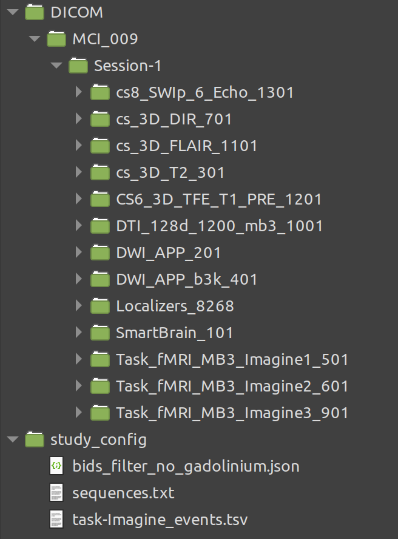
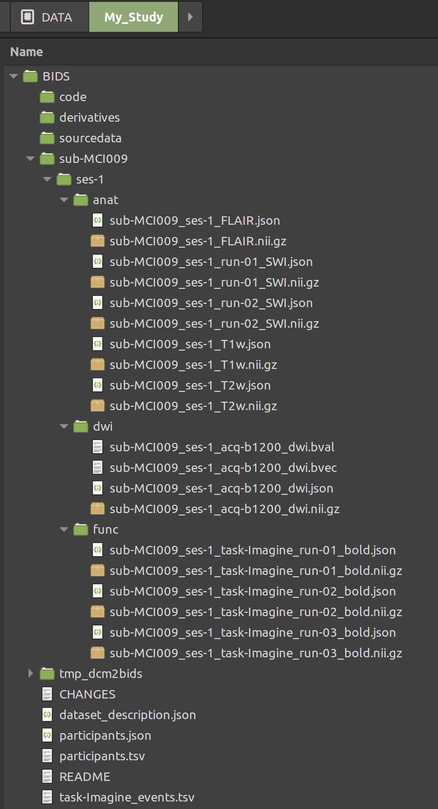

# KUL_dcm2bids

## Purpose

Use this command to convert dicom files to the BIDS format.


## Organise your data first

Although KUL_dcm2bids works however you organise the data, we suggest to use the following folder/data organisation (example):




## Usage

A typical command for conversion could be:  

`KUL_dcm2bids.sh -p MCI009 -s 1 -d DICOM/MCI_009/ -e -v -c study_config/sequences.txt`


You need to be in **main** directory to run this (in the example /DATA/My_Study). This is also where the BIDS folder will be created. Note that we did ***not*** use an underscore in the participant name (MCI009 not MCI_009).

For info about the command just run:

`KUL_dcm2bids.sh`


And this will output:

```
...more info above

Example:

  KUL_dcm2bids.sh -p pat001 -d pat001.zip -c definitions_of_sequences.txt

Required arguments:

     -d:  dicom_zip_file (the zip or tar.gz containing all your dicoms, or directory containing dicoms)
     -p:  participant (anonymised name of the subject in bids convention)
     -c:  definitions of sequences (T1w=MPRAGE,dwi=seq, etc..., see above)

Optional arguments:

     -o:  bids directory
     -s:  session (for longitudinal study with multiple timepoints)
     -t:  temporary directory (default = /tmp)
     -e:  copy task-*_events.tsv from config to BIDS dir
     -a:  further anonymise the subject by using pydeface (takes much longer)
     -v:  verbose 
```

Note: you can  specify a directory containing dicoms, but also use a zip file. The latter can be more handy (especially if you have to transfer thousands of them from/to a USB stick e.g.).

When you converted data (one or multiple subjects and sessions) please use the bids validator to check your BIDS directory.

## Output

Following the example above you will get:




## Config file

The KUL_dcm2bids config file describes what data you have acquired on the scanner and how it should be converted into the BIDS format.

A typical config file could look as follows:

```
#Identifier,search-string,task,mb,pe_dir,acq_label  
T1w,MPRAGE  
cT1w,T1_Gd  
FLAIR,3D_FLAIR_mind_study  
func,rsfMRI,rest,8,j,multiTE  
func,tb_fMRI,nback,2,j  
dwi,part1,-,2,j,b2000  
dwi,part2,-,2,j,b4000  
dwi,revphase,-,2,j-,rev
```  


The first column describes the BIDS data type. This is the type of scan that you have acquired, e.g. a "FLAIR", or a "func" for functional MRI data.
In the example above, we acquired a T1w (without intravenous Gd contrast), a cT1w (with contrast) and a FLAIR image, two functional MRI scans (1 multi echo resting-state and 1 singel echo during an n-back task) and the DTI data were acquired using 3 diffusion sequences. In a first diffusion acquisition b0 and b2000 were acquired. In the second diffusion scan b0 and b4000 were acquired. In a third scan a few b0 and 6 directions with b2000 weigthing were again acquired, but now using "reverse phase-encoding). 


KUL_dcm2bids needs information how to identify e.g. the diffusion scan with b0 and b4000 data. Therefore we use the second column. This second column defines a search pattern, i.e. a unique string that will search in the Series Description for e.g. the "FLAIR" or functional MRI data that you acquired. The Series Description was defined on the scanner (and corresponds to a dicom tag). On Philips scanners it corresponds to what you defined in the ExamCard. It could e.g. be "Smartbrain" or "3D_MPRAGE" or "DTI_part1_optimised_dd_21032017". 
KUL_dcm2bids will use the second column (I.e. the search pattern) to search through all dicom files to find e.g. a FLAIR.
Note that the search-pattern needs to be unique to define a certain data type. 


The third column gives information about the fMRI task. 


The config file requires more information for the data type "func" acquired on Philips scanners:

- Column 4 = mb: defines the multiband factor used in the GE-EPI sequence
- Column 5 = pe_dir: defines the phase-encoding direction used in the EPI sequence:
  -  for phase-encoding direction AP, fat-shift P: use j
  -  for phase-encoding direction AP, fat-shift A: use j-

The config file requires more information for the data type "dwi" acquired on Philips scanners:

- Column 3 = task: obsolote here (set to -)
- Column 4 = mb: defines the multiband factor used in the SE-EPI sequence
- Column 5 = pe_dir: defines the phase-encoding direction used in the EPI sequence

Note that the config file ONLY needs the above Columns 4 and 5 on PHILIPS Scanners. Siemens and GE have this encoded in the dicom header.

An example config file can be found in [study_config/sequences.txt](/study_config/sequences.txt)


## Supported images

### Structural

- T1w, cT1w, FLAIR, T2w, PDw: fully BIDS compliant
- FGATIR:  Fast Gray Matter Acquisition T1 Inversion Recovery, this is not yet specified in the BIDS
- SWI: susceptibility weigthed images that have been processed already on the scanner (minip and phase), this is not yet specified in the BIDS
- MTI: magnetisation transfer contrast images (a pair of images), this is not yet specified in the BIDS

### fMRI

- func: both single and multi echo data
- events.tsv: put these in the study_config file, and use option -e
- sbref: single band reference 
- fmap: a field map

### DWI

- dwi: diffusion MRI

### ASL

- ASL: arterial spin labeling, images that have already been processed on the MR scanner (a rCVF map), this is not what is specified in the BIDS convention (those are native images)


## Depedencies

Internally KUL_dcm2bids uses:
- [dcm2bids](https://github.com/UNFmontreal/Dcm2Bids)
- [dcm2niix](https://github.com/rordenlab/dcm2niix)

These could be installed using [KUL_Linux_Installation](https://github.com/treanus/KUL_Linux_Installation)
