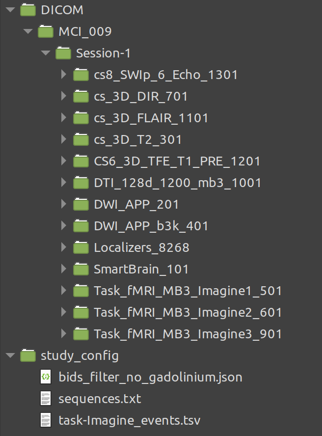
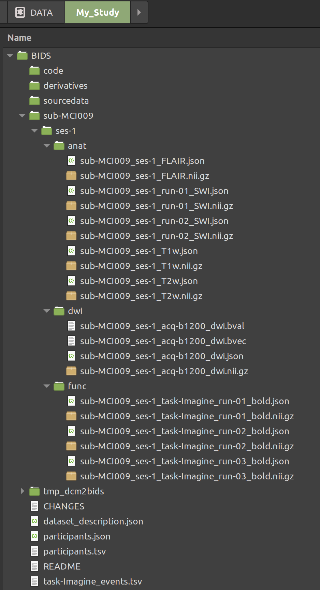

# KUL_dcm2bids

## Purpose

Use this command to convert dicom files to the BIDS format.


## Organise your data first

Although KUL_dcm2bids works however you organise the data, we suggest to use the following folder/data organisation (example):



Note that the MCI_009 folder could have been compressed into 1 zip or tar.gz file.   
Note too that the dicom folder could have contained thousands of dicom files in an unorganised manner.


## Usage

A typical command for conversion could be:  

`KUL_dcm2bids.sh -p MCI009 -s 1 -d DICOM/MCI_009/ -e -v -c study_config/sequences.txt`


You need to be in **main** directory to run this command (in the example /DATA/My_Study). This is also where the BIDS folder will be created. Note that we did ***not*** use an underscore in the participant name (MCI009 not MCI_009, which is not BIDS compliant).

For info about the command just run:

`KUL_dcm2bids.sh`


And this will output:

```
...more info above

Example:

  KUL_dcm2bids.sh -p pat001 -d pat001.zip -c definitions_of_sequences.txt

Required arguments:

     -d:  dicom_zip_file (the zip or tar.gz containing all your dicoms, or directory containing dicoms)
     -p:  participant (anonymised name of the subject in bids convention)
     -c:  definitions of sequences (T1w=MPRAGE,dwi=seq, etc..., see above)

Optional arguments:

     -o:  bids directory
     -s:  session (for longitudinal study with multiple timepoints)
     -t:  temporary directory (default = /tmp)
     -e:  copy task-*_events.tsv from config to BIDS dir
     -a:  further anonymise the subject by using pydeface (takes much longer)
     -v:  verbose 
```

Note: you can  specify a directory containing dicoms, but also use a zip or tar.gz file. The latter can be more handy (especially if you have to transfer thousands of them from/to a USB stick e.g.).

When you converted data (one or multiple subjects and sessions) please use the bids validator to check your BIDS directory.

## Output

Following the example above you will get:




## Script variants (dcm2bids v3 vs v2)

The dcm2bids tool changed its configuration schema between major versions. KUL_NIS ships three variants so you can match whichever dcm2bids is installed on your system:

| Script | dcm2bids version | Config schema | When to use |
|---|---|---|---|
| **`KUL_dcm2bids.sh`** (default) | **v3 (>= 3.0)** | `dataType` / `modalityLabel` / `customLabels` / `sidecarChanges` | Standard, recommended. This is the maintained version. |
| `KUL_dcm2bids_dev.sh` | v3 (>= 3.0) | same as above, **plus Philips PE-direction auto-detection** from DICOM private tag `[2005,107B]` | Testing only. Auto-derives phase-encoding direction for Philips DWI when header info is present. Not yet validated for all cases. |
| `KUL_dcm2bids_v2bkup.sh` | v2 (< 3.0) | `custom_entities` / `sidecar_changes` | Fallback for sites still pinned to dcm2bids v2. |

`KUL_dcm2bids.sh` runs a version-detection check at startup: if it finds dcm2bids v2 installed it prints a warning and points you to `KUL_dcm2bids_v2bkup.sh`. Upgrade with `pip install --upgrade dcm2bids`.

**Your config file schema must match the installed dcm2bids version** — a v2 config will not work with v3 and vice versa.

## Config file

The KUL_dcm2bids config file describes what data you have acquired on the scanner and how it should be converted into the BIDS format.

A typical config file could look as follows:

```
#Identifier,search-string,task,mb,pe_dir,acq_label  
T1w,MPRAGE  
cT1w,T1_Gd  
FLAIR,3D_FLAIR_mind_study  
func,rsfMRI,rest,8,j,multiTE  
func,tb_fMRI,nback,2,j  
dwi,part1,-,2,j,b2000  
dwi,part2,-,2,j,b4000  
dwi,revphase,-,2,j-,rev
```  


The first column describes the BIDS data type. This is the type of scan that you have acquired, e.g. a "FLAIR", or a "func" for functional MRI data.
In the example above, we acquired a T1w (without intravenous Gd contrast), a cT1w (with contrast) and a FLAIR image, two functional MRI scans (1 multi echo resting-state and 1 singel echo during an n-back task) and the DTI data were acquired using 3 diffusion sequences. In a first diffusion acquisition b0 and b2000 were acquired. In the second diffusion scan b0 and b4000 were acquired. In a third scan a few b0 and 6 directions with b2000 weigthing were again acquired, but now using "reverse phase-encoding). 


KUL_dcm2bids needs information how to identify e.g. the diffusion scan with b0 and b4000 data. Therefore we use the second column. This second column defines a search pattern, i.e. a unique string that will search in the Series Description for e.g. the "FLAIR" or functional MRI data that you acquired. The Series Description was defined on the scanner (and corresponds to a dicom tag). On Philips scanners it corresponds to what you defined in the ExamCard. It could e.g. be "Smartbrain" or "3D_MPRAGE" or "DTI_part1_optimised_dd_21032017". 
KUL_dcm2bids will use the second column (I.e. the search pattern) to search through all dicom files to find e.g. a FLAIR.
Note that the search-pattern needs to be unique to define a certain data type. 

### Anchoring the search-string

By default the search-string matches **anywhere** in the Series Description:
`t1_mprage` becomes the pattern `*t1_mprage*`. Anchor it when one Series
Description is a prefix or a superstring of another:

| written in the config | matches |
|---|---|
| `string` | anywhere in the description (the default) |
| `^string` | descriptions that **start with** `string` |
| `string$` | descriptions that **end with** `string` |
| `^string$` | descriptions **exactly equal to** `string` |

You need this more often than you would expect, and the failure is not loud:

**Post-contrast anatomicals.** Many scanners name the post-contrast series
`c_` + the pre-contrast name — `t1_mprage_sag_0.9mm-iso` and
`c_t1_mprage_sag_0.9mm-iso`. The search-string `t1_mprage` then matches *both*
series. When one series matches two descriptions dcm2bids refuses to place it
at all, logging

```
WARNING - sidecar.build_acquisitions | Several Pairing  <-  044_..c_t1_mprage_..
WARNING -     ->  _T1w
WARNING -     ->  _T1w
```

and leaving the scan in `BIDS/tmp_dcm2bids/`. **You end up with no
post-contrast T1w at all**, from a warning buried in a log. Write
`T1w,^t1_mprage` and the pre-contrast pattern no longer reaches the `c_` series.

**Console-derived series.** Scanners that save their own post-processing
alongside the acquisition produce siblings like `3D_T2_iso_Brainmask`,
`3D_T2_iso_SS`, `3D_T2_iso_SS_N4`, `3D_T2_iso_SS_N4_Dn`. These are all tagged
`ORIGINAL`, so no image-type filter separates them, and `3D_T2_iso` matches
every one — giving you five `_T2w` runs of which four are derivatives. Write
`T2w,^3D_T2_iso$`.

If in doubt, check what a pattern actually selects before converting:

```bash
python3 -c "
from fnmatch import fnmatch
descs = [...]                     # your Series Descriptions
print([d for d in descs if fnmatch(d.lower(), '*t1_mprage*'.lower())])"
```

Anchors are only interpreted by KUL_dcm2bids, which strips them before
searching the dicom dump-file and hands the anchored pattern to dcm2bids. Any
config written before they existed keeps working unchanged.


The third column gives information about the fMRI task. 


The config file requires more information for the data type "func" acquired on Philips scanners:

- Column 4 = mb: defines the multiband factor used in the GE-EPI sequence
- Column 5 = pe_dir: defines the phase-encoding direction used in the EPI sequence:
  -  for phase-encoding direction AP, fat-shift P: use j
  -  for phase-encoding direction AP, fat-shift A: use j-

The config file requires more information for the data type "dwi" acquired on Philips scanners:

- Column 3 = task: obsolote here (set to -)
- Column 4 = mb: defines the multiband factor used in the SE-EPI sequence
- Column 5 = pe_dir: defines the phase-encoding direction used in the EPI sequence

Note that the config file ONLY needs the above Columns 4 and 5 on PHILIPS Scanners. Siemens and GE have this encoded in the dicom header.

An example config file can be found in [study_config/sequences.txt](/study_config/sequences.txt)


## Supported images

### Structural

- T1w, cT1w, FLAIR, T2w, PDw: fully BIDS compliant
- FGATIR:  Fast Gray Matter Acquisition T1 Inversion Recovery, this is not yet specified in the BIDS
- SWI: susceptibility weigthed images. Magnitude (SWI) and phase (SWIp) are split into separate series; not yet specified in the BIDS (listed in `.bidsignore`)
- DIR: double inversion recovery; not yet specified in the BIDS (listed in `.bidsignore`)
- MP2RAGE: stored with its INV1/INV2/UNI parts; not yet specified in the BIDS (listed in `.bidsignore`)
- MTI: magnetisation transfer contrast images (a pair of images), this is not yet specified in the BIDS

### fMRI

- func: both single and multi echo data
- events.tsv: put these in the study_config file, and use option -e
- sbref: single band reference 
- fmap: a field map

### DWI

- dwi: diffusion MRI

### ASL

- ASL: arterial spin labeling. Converted into `perf/`, and listed in
  `.bidsignore` — the sidecar does not carry the fields BIDS requires for ASL
  (`LabelingDuration`, `BackgroundSuppression`, `M0Type`) and no
  `_aslcontext.tsv` is written, so the tree would not validate.

An ASL protocol normally yields **several** series that share a `ProtocolName`
but differ in `SeriesDescription`: the raw label/control series, plus whatever
the console derived from it. Give each one its own line and tell them apart
with `acq_label`:

```
#Identifier,search-string,task,mb,pe_dir,acq_label
ASL,pcasl_3d_pld1800,-,-,-,raw
ASL,Perfusion_Weighted,-,-,-,deltam
ASL,relCBF,-,-,-,cbf
```

giving `perf/sub-X_acq-raw_asl.nii.gz`, `_acq-deltam_asl.nii.gz` and
`_acq-cbf_asl.nii.gz`.

Two things are specific to ASL here:

- **The derived series are accepted.** Every other identifier restricts itself
  to `ORIGINAL` images, which keeps reformats and console post-processing out
  of the tree. For perfusion the console's subtraction and rCBF maps are
  genuinely wanted, and they are `DERIVED` by definition, so the ASL identifier
  falls back to an unfiltered search when no `ORIGINAL` series matches.
- **Matching is on `SeriesDescription` alone.** Pinning `ImageType` does not
  survive contact with more than one vendor: dcm2bids compares `ImageType`
  element-wise *and* requires the lists to be the same length, so a criterion
  written for Philips (`ORIGINAL\PRIMARY\PERFUSION\NONE`) fails a Siemens pCASL
  (`ORIGINAL\PRIMARY\ASL\NONE\MAGNITUDE`) on the length check before comparing
  a single string — and converts nothing, silently, because "no series matched"
  is not an error. Make the search-string specific instead.

Nothing in KUL_NIS processes ASL yet; the conversion puts the data in the tree.

#### Do not trust the ASL timing in the sidecar

**`PostLabelingDelay` in a dcm2niix sidecar may actually be the labeling
duration.** Check it against your protocol before using it for anything
quantitative.

On the Siemens study this was found on (MAGNETOM Cima.X, syngo MR XA61, 3D
pCASL), the sidecar reads `PostLabelingDelay: 1.8`. The only timing value in
any standard DICOM tag is

```
(0018,9258) ASLPulseTrainDuration  UL  1800
```

which the DICOM standard defines as the duration of the **labeling** pulse
train — not the post-labeling delay. The vendor's own embedded protocol
confirms that reading:

```
sAsl.ulLabelingDuration      = 1800000   µs
sAsl.sPostLabelingDelay[0]   = 1800000   µs
```

On this protocol both happen to be 1800 ms, so the sidecar is accidentally
correct and it is **not possible to tell from this study** whether dcm2niix
read the standard tag or the vendor protocol. On any protocol where labeling
duration ≠ PLD — the common case — a sidecar populated from `(0018,9258)`
would report the labeling duration under the name `PostLabelingDelay`. CBF
scales with both, so the error would be quantitative and invisible.

Until someone confirms this on a protocol where the two values differ, treat
the sidecar field as unverified and state the timings explicitly in the config
file.

On Siemens you can read the real values out of the embedded protocol:

```bash
strings <one.dcm> | grep -E "sAsl\.(ulLabelingDuration|sPostLabelingDelay\[0\]|ulSuppressionMode|ulDelayArraySize)"
```

Values are in microseconds. `ulDelayArraySize` > 1 means a multi-delay
acquisition, for which a single `PostLabelingDelay` is wrong altogether.
`ulSuppressionMode` records background suppression, but as an undocumented
enum (observed: `8`, on a sequence whose product default is BS on) — non-zero
is suggestive, not conclusive, so supply background suppression yourself rather
than inferring it. None of this exists on Philips or GE: it is a Siemens
private protocol dump, not part of the DICOM ASL module.

#### Do not trust `ASLContext` either

The DICOM MR Arterial Spin Labeling module has a per-frame `ASLContext`
(0018,9257) that ought to be the authoritative source for an
`_aslcontext.tsv`. On the same study it is wrong — shifted by one, and with no
`M0` state at all:

| volume | `ImageComments` (0020,4000) | `ASLContext` (0018,9257) |
|---|---|---|
| 1 | `M0_SCAN` | `LABEL` |
| 2 | `LABEL` | `CONTROL` |
| 3 | `CONTROL` | `LABEL` |
| 4 | `LABEL` | `CONTROL` |

It labels the proton-density M0 volume as a LABEL, which it cannot be.
`ImageComments` is self-consistent (M0, then strict LABEL/CONTROL alternation).

So anything deriving a volume-type list should read `ImageComments`, and should
**validate** what it reads — first volume M0, strict alternation thereafter —
and refuse rather than guess when the pattern does not hold. Built against the
standard tag instead, every `_aslcontext.tsv` from this scanner would have been
silently off by one.

### DSC

- DSC: dynamic susceptibility contrast perfusion. See
  [KUL_dsc_perfusion](/docs/KUL_dsc_perfusion/KUL_dsc_perfusion.md).

## Vendor detection

`mb` and `pe_dir` (columns 4 and 5) are only needed on Philips, because Siemens
and GE put the echo spacing, readout time and slice timing in the header.
KUL_dcm2bids decides which path to take from `Manufacturer` (0008,0070),
matching the vendor **prefix**, case-insensitively.

That tag is not a controlled value. Older Siemens systems write `SIEMENS`; the
XA line (VIDA, Cima.X, …) writes `Siemens Healthineers`. If your study prints

```
It's NOT original dicom data (anonymised?): ees/trt could not be calculated
```

once per series on data you know is not anonymised, the vendor test did not
recognise the string. Check what your scanner actually writes:

```bash
dcminfo <one.dcm> -tag 0008 0070
```

and compare it against the test in `kul_dcmtags`. On Siemens the message is
cosmetic — dcm2niix fills the sidecar either way — but it means the Philips
`ees`/`trt` calculation is being attempted on data that has no
Philips-private tags to calculate it from.


## Dependencies

Internally KUL_dcm2bids uses:
- [dcm2bids](https://github.com/UNFmontreal/Dcm2Bids) — **v3 (>= 3.0)** for the default script; v2 only with `KUL_dcm2bids_v2bkup.sh`
- [dcm2niix](https://github.com/rordenlab/dcm2niix)
- [pydeface](https://github.com/poldracklab/pydeface) — only when using `-a` (further anonymisation)

These could be installed using [KUL_Linux_Installation](https://github.com/treanus/KUL_Linux_Installation)
